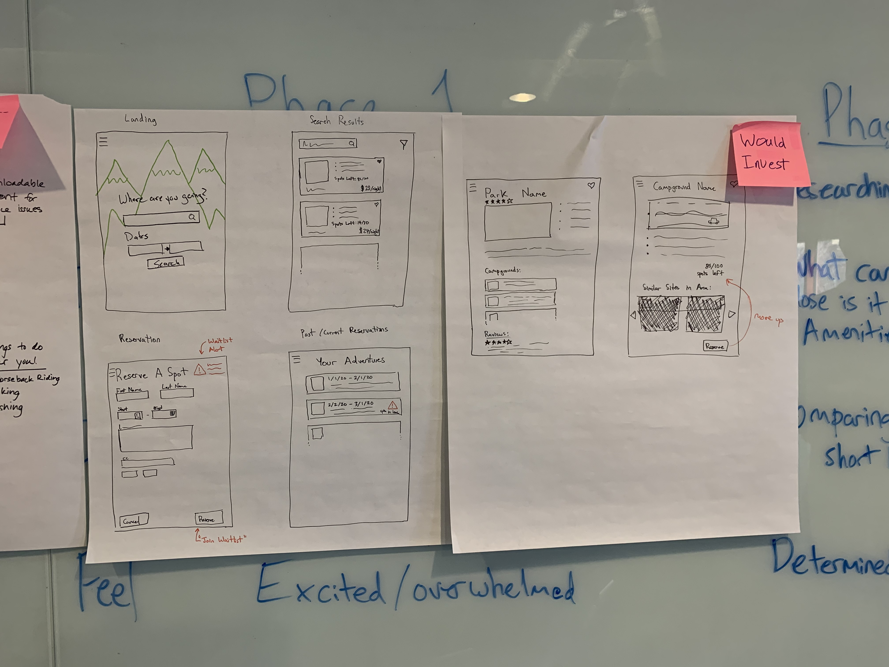

### Once Upon a Whiteboard
The purpose of this project is to integrate with the [Camply](https://juftin.com/camply/) site booking library writeen in Python. The idea has been a side pet project of mine for a few years now and, with my recent body of work in the API and Microsoft Bot Framework, I'm spending time to make it a reality. 

The general idea is to have a site UI for trip planning, a bot service that takes in user's queries vs just piping stuff through a command line or disparate reservation sites (as Camply offers a great many State and National services and the provider is actually a parameter). Further, with a strategic integration with various cognitive services, I beleive it's possible to provide a better more personalized reservation and trip planning epxerience for encouraing people (myself for now) to get outdoors.

### Project Outline
This architecture is designed to create an integrated, multi-functional system for campground booking and trip planning, building on the capabilities of the Camply Python library while adding a user-friendly interface, a conversational bot service, and potential cognitive service integrations for personalization.

### Project Structure Overview
- **/Camply.Receiver**
  - **/Helpers**: Contains middleware response parsers that translate raw responses from the Camply library or middleware into structured data for the .NET API, making the data more manageable for the UI and bot interactions.
  - **/Logic**: Houses command constructors, responsible for creating and managing commands to send to the Camply middleware. This layer acts as an intermediary, assembling requests and handling the interaction between the .NET API and Camply.
  - **/Models**: Defines the domain models, including data structures for campground availability, user preferences, and trip plans. These models are used across the API, UI, and bot to ensure consistency in data representation.
  - **/Scripts**: Hosts Python scripts or services (the middleware) to interact with Camply directly. The Camply library, being written in Python, operates here, allowing for direct communication with the Camply API or service and serving as a bridge between the .NET API and the Python Camply library.
  - **/Services**: Reserved for future integration with cognitive services, such as natural language processing, image recognition, or sentiment analysis, to enhance user interactions and make trip planning more personalized and accessible. Cognitive services could analyze user preferences or interpret complex queries.
  - **Program**: The core of the .NET API model, providing endpoints that the React UI and the Trip-BotSkill will use. This component exposes API methods to query campground availability, manage user preferences, and interact with middleware and cognitive services.

- **/Trip-BotSkill** (to do): A bot built on the Microsoft Bot Framework that will allow users to interact conversationally with the system. Users could ask questions or specify booking preferences, and the bot would guide them, using natural language to interpret their intent and suggest or reserve campgrounds accordingly.
  
- **/React UI** (to do): A front-end interface designed to make it easy to search for and book campsites, set preferences, and plan trips. The UI would present options based on user input, with an emphasis on creating a visual and accessible experience for booking. Users can interact with maps, search by dates and location, and see recommendations and campground details in a structured format.

### Project Purpose
The aim is to take the powerful booking capabilities of the Camply library, typically used in a command-line interface, and make it accessible through a modern, user-friendly platform. This involves:
1. **Providing an Interactive UI**: Instead of relying on command-line outputs, users get a web interface for browsing, filtering, and selecting campsites, improving accessibility and usability.
2. **Adding Conversational Capabilities with a Bot**: The bot serves as a virtual assistant, allowing users to ask questions or seek recommendations for campgrounds. It can simplify complex queries by processing natural language and handling personalized suggestions, guiding users through the booking process conversationally.
3. **Personalizing the Experience with Cognitive Services**: Future cognitive service integrations could analyze user preferences, provide recommendations based on past trips, or help with travel planning. For instance, image recognition could suggest campsites based on photos, and sentiment analysis might personalize recommendations.

### Key Benefits
- **Enhanced Accessibility and Ease of Use**: Users can interact via both a graphical UI and a conversational bot, lowering the barrier to entry compared to command-line use.
- **Personalized Recommendations**: Cognitive integrations allow for a more tailored experience, where users receive campsite suggestions based on their preferences and historical data.
- **Improved Planning and Booking**: Through the UI and bot, users have access to a centralized platform that aggregates various reservation sites and offers strategic recommendations, enhancing their overall planning process.

### High-Level Flow
1. **User Interaction**: Users can interact via the React UI or the Trip-BotSkill.
2. **API Requests**: The UI or bot sends requests to the .NET API in Camply.Receiver.
3. **Command Handling and Parsing**: The API interacts with Camply through middleware services, which handle complex logic and translate Python responses into structured .NET data.
4. **Response and Recommendations**: Middleware parsers process responses, potentially enhanced by cognitive services, to deliver personalized recommendations back to the UI or bot.
5. **Booking Confirmation**: Users confirm bookings, which are processed and stored in the system, with options for managing trips and preferences.

This setup leverages modern web and AI technologies to make campsite booking and trip planning more engaging, intuitive, and tailored to user needs, all while enhancing the utility of the Camply library.